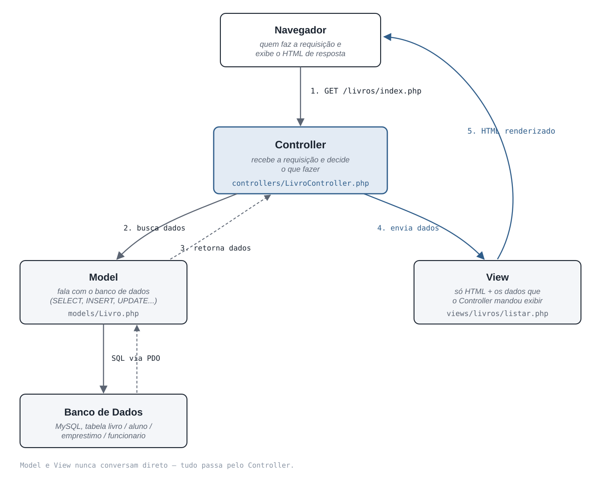

# Arquitetura MVC deste projeto

O projeto em `php/public/` não usa framework — é PHP puro organizado
manualmente em três papéis (Model, View, Controller). Esse padrão existe
para separar três preocupações que, num PHP "tudo misturado", ficam todas
no mesmo arquivo: **acesso ao banco**, **regra de decisão** e
**apresentação (HTML)**.

## O ciclo de uma requisição



Exemplo real do projeto — o que acontece quando alguém abre
`/livros/index.php` no navegador:

1. **Navegador → Controller.** O navegador faz `GET /livros/index.php`.
   Esse arquivo é só um "ponto de entrada": ele confere se o funcionário
   está logado (`AuthController::exigirLogin()`) e chama o Controller.
2. **Controller → Model.** `LivroController::index()` não sabe nada de
   SQL — ele só pede ao Model: "me dê a lista de livros"
   (`$livroModel->listarTodos()`).
3. **Model → Banco → Model.** `models/Livro.php` é o único lugar do
   projeto que fala `SQL`/`PDO` diretamente com o MySQL. Ele executa o
   `SELECT` e devolve um array de livros para o Controller.
4. **Controller → View.** O Controller recebe os dados e faz
   `require` da view, deixando a variável `$livros` disponível para ela
   (`views/livros/listar.php`).
5. **View → Navegador.** A view é só HTML com `<?= ?>` pontual — nenhuma
   consulta ao banco acontece ali. O resultado (HTML puro) é o que o
   navegador recebe e exibe.

## Por que separar assim

- **Model nunca fala com a View, e vice-versa.** Tudo passa pelo
  Controller. Isso evita HTML misturado com `SELECT` no mesmo arquivo —
  se quiser mudar o layout de uma tela, não precisa tocar em SQL, e
  vice-versa.
- **Um Model por entidade.** Cada tabela do banco (`livro`, `aluno`,
  `emprestimo`, `funcionario`) tem sua classe Model correspondente, com os
  métodos de acesso a dados daquela tabela (`create`, `listarTodos`,
  `buscarPorId`, `atualizar`, `excluir`...).
- **Um Controller por módulo.** Cada Controller (`LivroController`,
  `AlunoController`, `EmprestimoController`) concentra a lógica de uma
  tela: o que fazer quando chega um `GET` (mostrar formulário/lista) e o
  que fazer quando chega um `POST` (validar e chamar o Model).
- **Views são "burras" de propósito.** Elas só recebem variáveis prontas
  e as imprimem — não decidem nada, não consultam nada.

## Onde cada papel mora no projeto

```
php/public/
├── config/Banco.php        → conexão PDO (usada só pelos Models)
├── models/                 → 1 classe por tabela, só SQL
│   ├── Livro.php
│   ├── Aluno.php
│   ├── Emprestimo.php
│   └── Funcionario.php
├── controllers/             → 1 classe por módulo, a "cola" entre Model e View
│   ├── LivroController.php
│   ├── AlunoController.php
│   ├── EmprestimoController.php
│   └── AuthController.php
├── views/                   → só HTML + variáveis, nada de SQL
│   ├── livros/ alunos/ emprestimos/ auth/ layout/
└── livros/ alunos/ emprestimos/   → pontos de entrada (as "URLs" da aplicação),
                                       cada um só chama o Controller certo
```
