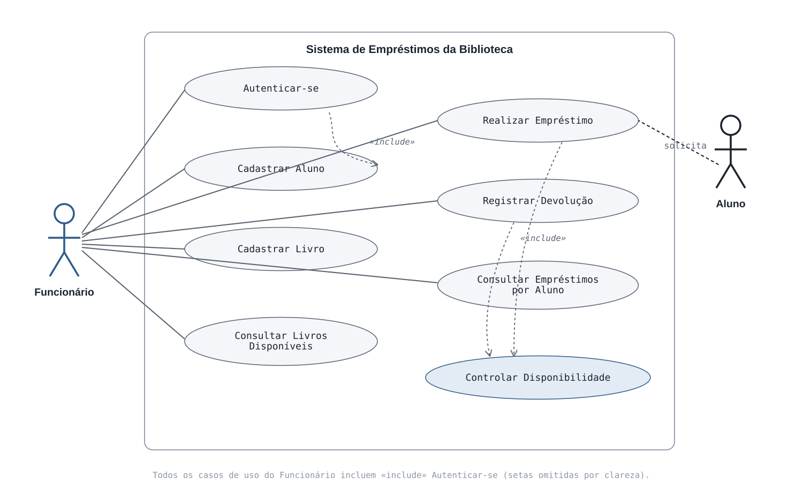
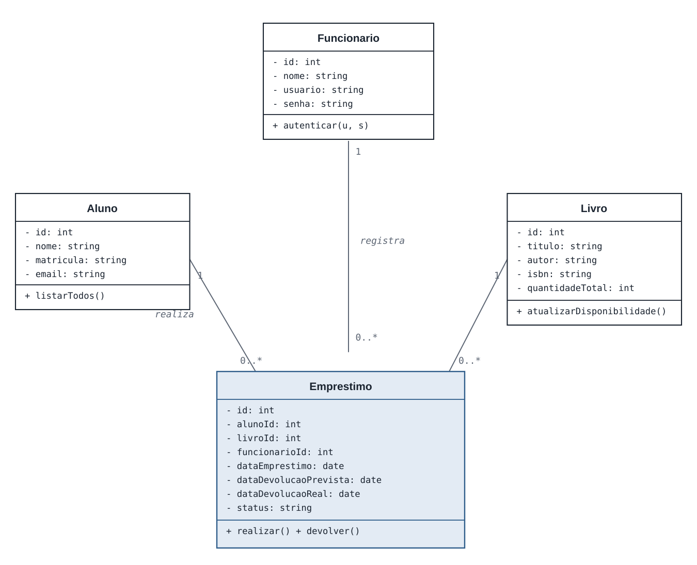

# Diagramas UML — Sistema de Empréstimos da Biblioteca

Recorte prático do estudo de caso da biblioteca, usado como base do projeto
de 3 aulas em `php/public/`. Em vez das 7 funcionalidades completas do
enunciado original, o projeto de sala trabalha 4 classes: **Funcionário**,
**Aluno**, **Livro** e **Empréstimo**.

## Diagrama de Casos de Uso

**Atores**
- **Funcionário** (ator principal): autentica-se e opera todos os
  cadastros, consultas e movimentações do sistema.
- **Aluno** (ator secundário): não opera o sistema diretamente — está
  associado apenas a "Realizar Empréstimo", pois é ele quem solicita o
  empréstimo ao funcionário.

**Casos de uso**
- Autenticar-se
- Cadastrar Aluno
- Cadastrar Livro
- Consultar Livros Disponíveis
- Realizar Empréstimo
- Registrar Devolução
- Consultar Empréstimos por Aluno
- Controlar Disponibilidade de Livros

**Relações `<<include>>`**
Todos os casos de uso do Funcionário exigem login — por isso incluem
"Autenticar-se" (no diagrama, só duas setas de `<<include>>` foram
desenhadas para não poluir a imagem, mas a regra vale para todos).
"Controlar Disponibilidade de Livros" não tem ator próprio: ele é
disparado automaticamente por "Realizar Empréstimo" e "Registrar
Devolução" — é o sistema atualizando o estoque sozinho, não uma ação que
alguém pede diretamente.

## Diagrama de Classes

| Classe | Atributos principais |
|---|---|
| `Funcionario` | id, nome, usuario, senha |
| `Aluno` | id, nome, matricula, email |
| `Livro` | id, titulo, autor, isbn, quantidadeTotal, quantidadeDisponivel |
| `Emprestimo` | id, dataEmprestimo, dataDevolucaoPrevista, dataDevolucaoReal, status |

**Relacionamentos e multiplicidades**
- `Funcionario` **1** — **0..\*** `Emprestimo` (*registra*): um funcionário
  pode registrar vários empréstimos.
- `Aluno` **1** — **0..\*** `Emprestimo` (*realiza*): um aluno pode ter
  vários empréstimos ao longo do tempo.
- `Livro` **1** — **0..\*** `Emprestimo` (*é emprestado em*): um exemplar
  de livro passa por vários empréstimos diferentes.

`Emprestimo` funciona como uma classe de associação entre `Aluno` e
`Livro`: ao invés de uma relação direta N:N entre os dois, o empréstimo
tem identidade própria (datas, status) e concentra a regra de negócio —
verificar disponibilidade, dar baixa no estoque ao emprestar e repor ao
devolver. É por isso que o módulo de Empréstimo é o desafio da Aula 3: ele
não é só CRUD, ele orquestra as outras duas classes.
